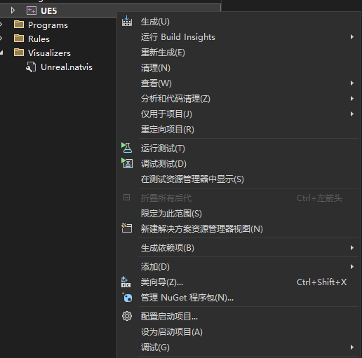
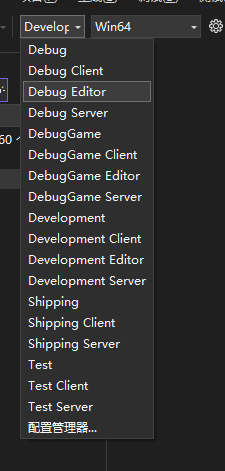
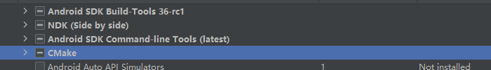
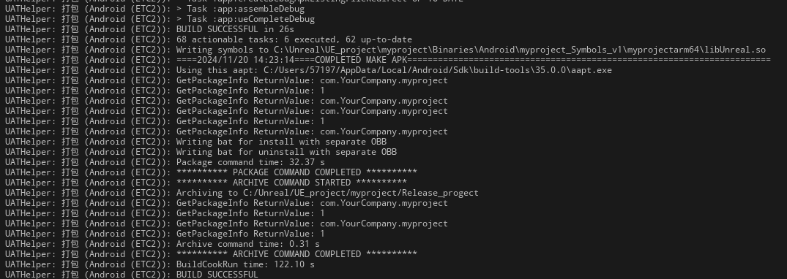
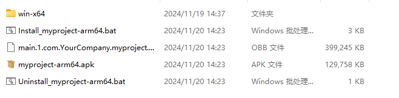
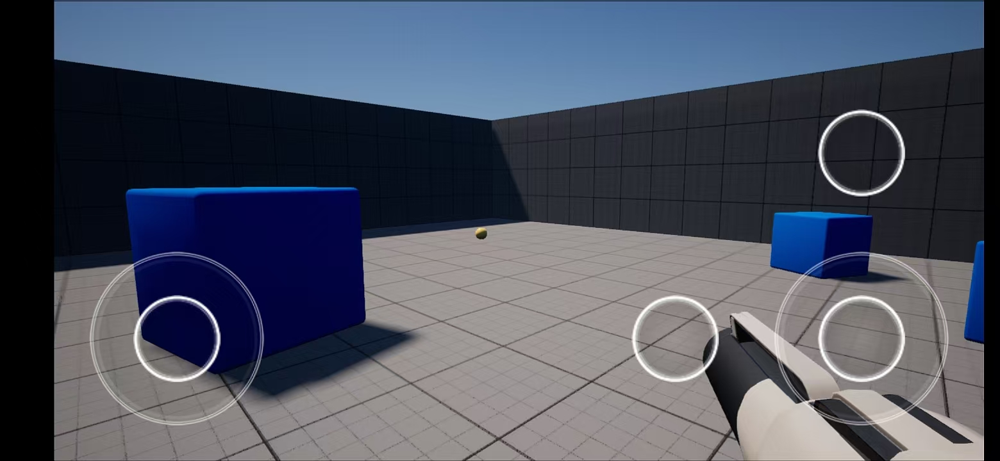

# 腾讯2024客户端公开课第一周作业

# 一.任务目标

1.源码编译UE5，新建一个C++工程，进行简单场景编辑和工程设置
2.编译并构建安装包，成功将游戏工程安装到手机正常运行

# 二.实现过程

## 1.编译UE5

运行Setup.bat 和 GenerateProjectFiles.bat

点击UE5.sln

右键ue5并设置为启动项

设置Development Editor Win64 启动 后进行UE5编译

## 2.编译并构建安装包

使用Android Studio安装安卓SDK和NDK 并设置系统变量

使用脚本/手动设置UE上的Android sdk路径

勾选图中所示的选项

编译安卓版本

编译成功

成功在手机运行

